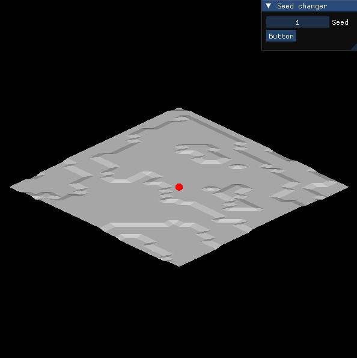

# Preview
A small preview of the program which I update almost every commit
<p>
    
</p>

# Build

I use MSVC and vcpkg. Run these commands to install the required packages:

```bash
vcpkg install glfw3
vcpkg install glm
vcpkg install opengl
vcpkg install imgui[core,glfw-binding,opengl3-binding]
```